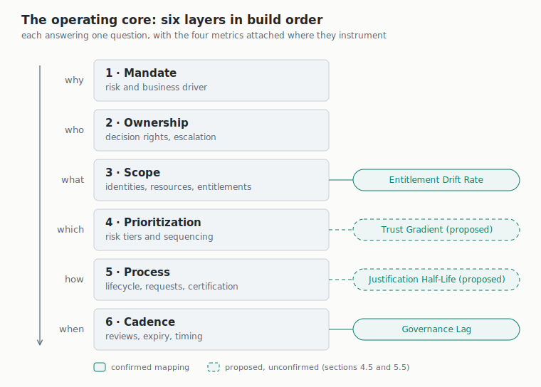
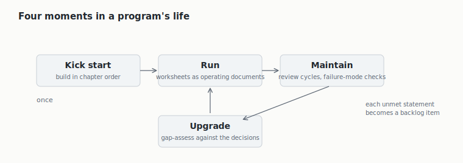

# Open IGA Operating Framework

*v0.1 public draft · maintained by Vidyaa Ganesh, Identara (identara.ca) · CC BY 4.0 · DOI 10.5281/zenodo.21251831*

> **Status.** Nothing in this repository is ratified. The operating core is drafted and carries normative language for review. The Operational Metrics Specification is assembled from the published research. Two instrumentation mappings are proposed and unconfirmed: Trust Gradient on Prioritization (core section 4.5) and Justification Half-Life on Process (core section 5.5); each carries no normative weight until confirmed empirically against the pilot reference dataset on the roadmap.

## What this is

This document is the instruction manual for running an identity governance program. The tools handle the mechanics of granting and removing access. This framework covers everything around the tools: why the program exists, who owns the access decisions, what the program covers, what gets attention first, how the day-to-day processes run, and how often everything gets checked. An organization starting from nothing builds in the order of the six chapters. An organization already running a program holds each chapter up as a checklist, and the failure modes show what is broken. The metrics specification then tells it whether the program is improving.

## The core at a glance

The core in one diagram: six layers in dependency order, each answering one question, with the four metrics attached where they instrument. Solid connections are confirmed mappings; dashed connections are proposed and unconfirmed (sections 4.5 and 5.5).



The core modulates along two independent axes. Starting state decides where a program begins, and archetype decides what it is building toward. The nine combinations below are all real programs, and the six layers are the same in every cell.

| | Regulated enterprise | Small product organization | Public sector body |
|---|---|---|---|
| **Greenfield** (no governance yet) | New banking subsidiary | Startup standing up its first controls | Newly created agency |
| **Bluefield** (partial rebuild beside legacy) | Bank mid-migration to a new IGA platform | Scale-up replacing its early tooling | Ministry modernizing one directorate |
| **Brownfield** (years of accumulated access) | Established insurer, never governed centrally | Ten-year-old SaaS with entitlement debt | Legacy department estate |

## Conventions and reading paths

Language: **must** marks a requirement without which a layer fails. **Should** marks normative guidance a program follows unless it records a reason for departing. **May** marks an option.

Every normative statement carries an identifier (M1, O1, S1, P1, PS1, C1 in the core, MS1 in the metrics specification, AP1 in the profile specification) and every failure mode an F number local to its chapter, so review feedback can cite them directly.

Three reading paths. New to identity governance: read What this is and `TERMINOLOGY.md`, then each chapter's Purpose and Failure modes; the observable signals work as a symptom checklist for any organization, and the worked example in `examples/` shows one organization doing all of it. Running a program already: gap-assess against the numbered decisions chapter by chapter, and record where your program departs and why. Reviewing the framework: the contestable stances are flagged at M2, M8, O2, P4, PS4, and C2, plus the two proposed metric mappings (core sections 4.5 and 5.5). Diagrams restate what the prose already establishes, and every example is marked non-normative; nothing binding lives only in a picture or an example.

## Repository structure

```
README.md                    front door: overview, conventions, reading paths
TERMINOLOGY.md               plain-language definitions
core/01-mandate.md ... 06    the six-layer operating core (normative draft)
metrics/                     Operational Metrics Specification
profiles/                    archetype profile specification (contribution surface)
companions/                  nine non-normative fill-in artifacts, Word versions in docx/, and the explorer
examples/                    the Fernway worked example: all six layers, every worksheet filled
figures/                     all diagrams as editable SVG
CHANGELOG.md · CONTRIBUTING.md · GOVERNANCE.md · LICENSE · LICENSE-CODE · CITATION.cff
tools/                       lint gate: python3 tools/lint.py before any commit
open-iga-operating-framework-v0.1-draft.md   single-file reading edition
```

The split files are the citation surface for issues and pull requests. They and the single-file edition are emitted together from one source by a build pipeline, so no file is hand-edited independently, and `tools/lint.py` is the gate every change passes.

## Why this exists

The identity field has controls catalogues, bodies of knowledge, and maturity models. What it lacks is a published account of the operating layer: who owns access decisions, how those decisions escalate when they conflict, who is accountable across each step of joiner, mover, and leaver, and how the people who build the program are kept separate from the people who run it and the people who govern it.

The operating-layer material that exists today is held internally or delivered through consulting engagements. Organizations standing up or maturing an IGA program end up rebuilding the same operating model independently, most of them without a baseline to measure against. This project publishes an open, adaptable version so that work is not repeated in isolation.

## How organizations use this framework

The framework serves a program at four moments: when an organization kick starts one, runs one, maintains one, or upgrades one.



**Kick start.** An organization with no program builds in chapter order. The charter template is the first artifact, and the on-ramp selector in the tier worksheet sets the first concrete move. The scope register then grows through its onboarding gate from day one.

**Run.** Once filled in, the worksheets stop being templates and become the program's operating documents. Chapters 5 and 6 govern the day to day, and the responsibility matrix and cadence table are the two a running program touches most.

**Maintain.** The core builds its own upkeep in: the charter carries a review cycle (M8), tiers are revisited (P5), the cadence table reviews itself (C7), and exceptions expire (PS6). Between those cycles, the failure-mode signals run as a periodic symptom check, and the metrics specification reads whether the program still responds.

**Upgrade.** The numbered decisions double as an assessment instrument. Gap-assess the program against them; every unmet statement is a backlog item, and chapter 4's own tier logic sequences the backlog. The modulation sections describe how each layer's shape changes as the organization grows.

## Coverage map

The framework is organized by decision order rather than as a dimension inventory: an inventory tells you what a program has, and the build order tells you what to decide first. Every dimension of a complete operating model is still covered, and the table shows where each lives, including what is excluded on purpose and why. An operating model is what one organization designs for itself; working through this framework is how an organization produces its own.

| Dimension | Where it lives | Status |
|---|---|---|
| Governance and mandate | Chapters 1 and 2; C6 to C8 | Normative core |
| People and organization | Chapter 2 (O1 to O8); topology in profiles | Core plus profiles |
| Team topology and interfaces | O2 and O8; topology and sourcing in profiles | Core plus profiles |
| Scope and inventory | Chapter 3 | Normative core |
| Prioritization and risk tiering | Chapter 4; Trust Gradient proposed | Normative core |
| Process, risk-bearing core | Chapter 5, PS1 to PS8 | Normative core |
| Process, wider surface | Section 5.7 | Non-normative; numbered taxonomy on roadmap |
| Lifecycle states | PS1, PS7, PS8; chapter 5, F7 to F9 | Normative core |
| Cadence and monitoring rhythm | Chapter 6, C1 to C8 | Normative core |
| Program metrics | `metrics/`, four metrics, MS1 to MS12 | Normative draft |
| Operational telemetry | Telemetry catalogue in `metrics/` | Non-normative, representative |
| Technology and platform | Excluded by design; capability requirements in the platform capability checklist, data model in `metrics/`, S2 and S4 | Tool-agnostic by design |
| Audit and standards mapping | Crosswalk annex | Roadmap; edition-verified before shipping |
| Maturity assessment | Gap-assessment against the numbered decisions; AXIS as one reference implementation | Core mechanism |
| Archetype adaptation | `profiles/`, AP1 to AP5 | Specification drafted; profiles open |
| Worked demonstration | `examples/`, Fernway | Non-normative example |

## Scope and architecture

The framework has three parts.

1. **Operating core** (part II, v0.1 draft). Six ordered layers of normative guidance: Mandate, Ownership, Scope, Prioritization, Process, and Cadence. The order is a dependency order, and each layer consumes the output of the layers above it.
2. **Operational Metrics Specification** (drafted; see `metrics/`). Formal definitions and calculation methods for measuring IGA responsiveness, covering four metrics: Entitlement Drift Rate, Governance Lag, Justification Half-Life, and Trust Gradient.
3. **Archetype profiles** (profile specification drafted; see `profiles/`; profiles open for contribution). Adaptations of the operating core for different organizational structures, since no single operating model fits every organization. Profiles are the mechanism that lets the core stay adaptable without becoming vague.

## Roadmap

- Reference dataset from a pilot to ground the metrics with real measurements.
- Standards crosswalk annex mapping statements to ISO/IEC 27001, NIST CSF, and comparable frameworks, shipped only once every control identifier is verified against its current edition.
- Practitioner review through IDPro and the enterprise IAM conference circuit, alongside standards-community review at IIW XLIII (Mountain View, November 2026).
- Repository continuous integration running `tools/lint.py` on every change.
- Ratification of the core following review, and archetype profiles opened for practitioner contribution.

Roadmap items are stated in intended order. They are not commitments to a date.

## Relationship to existing work

This framework is designed to sit alongside the standards a program already follows. ISO/IEC 27001 and NIST specify what controls to implement. The IDPro Body of Knowledge explains identity concepts. Gartner and comparable analysts assess maturity. This framework addresses the layer beneath them, which is how the program runs day to day and who is accountable for each part of it. It fills the operating-layer gap those references leave open.


The closest public prior art for the operating layer is FICAM, the United States federal government's identity, credential, and access management architecture and playbooks, maintained by GSA at idmanagement.gov. It covers enterprise identity processes, practices, and policies for federal employees, contractors, and partners, in architecture and playbook form. The differences are scope and form: FICAM is government-scoped guidance, and this framework is sector-neutral and written as numbered decisions a program can gap-assess against. The public sector archetype profile is where the two meet most directly.
## Reference implementations

The framework is tool-agnostic. Any assessment tool or IGA platform can implement it. AXIS, a free IGA maturity assessment that evaluates governance as its own domain, is one reference implementation. Listing a reference implementation is not an endorsement requirement. The normative text stands independent of any tool.

## Versioning and changes

The framework uses semantic versioning. A move from 1.0 to 1.1 means additive changes that do not break an existing conformance claim. A move from 1.0 to 2.0 means a breaking change. A changelog records every version. Changes are proposed through issues. The change process for normative text, the distinction between editorial and normative changes, and the external review panel required for ratification are defined in `GOVERNANCE.md`.

## Contributing

Archetype profiles are the primary contribution surface. If you run an internal IGA operating model, a profile documents how the operating core adapts to your organizational structure, and it lets others reuse that adaptation. Open an issue to propose a profile or to comment on any chapter of the core.

## Licence

The text of this framework is licensed under Creative Commons Attribution 4.0 International (CC BY 4.0). You may share and adapt the material for any purpose, including commercially, provided you give appropriate credit and indicate whether changes were made.
 The interactive explorer's code (HTML, CSS, JavaScript) is additionally available under the MIT licence (`LICENSE-CODE` in the repository), since CC BY fits prose better than it fits code.
## Citation

Cite the framework as:

> Ganesh, V. *Open IGA Operating Framework* (v0.1). Identara. DOI: 10.5281/zenodo.21251831. Available at: https://github.com/identara/iga-operating-framework

The metrics research underlying the Operational Metrics Specification has a separate formal citation:

> Ganesh, V. *Measuring What Moves.* SSRN, abstract ID 6842545. DOI: 10.2139/ssrn.6842545


---

*Open IGA Operating Framework, v0.1 draft. Licensed under CC BY 4.0.*
