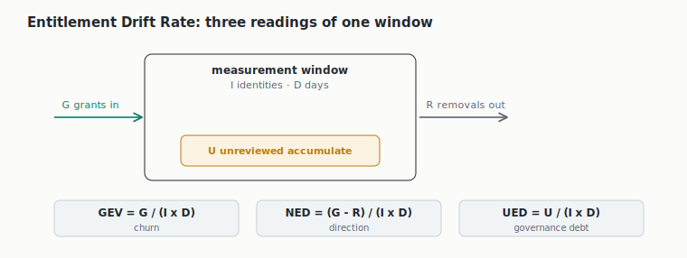
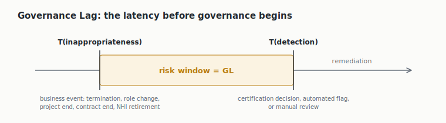
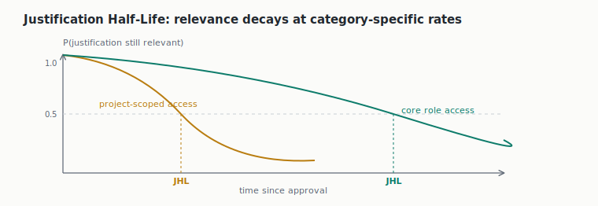
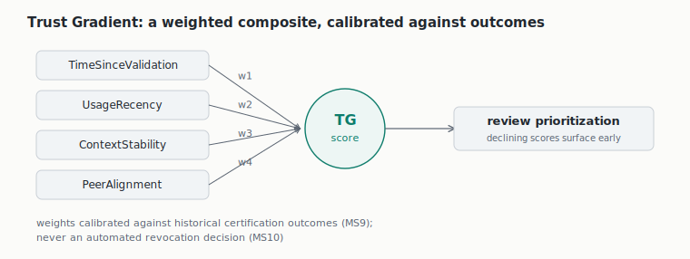

# Open IGA Operating Framework

*Consolidated single-file draft, version 0.1, July 2026. Maintained by Vidyaa Ganesh, Identara (identara.ca). Licence: CC BY 4.0.*

## What this is

This document is the instruction manual for running an identity governance program. The tools handle the mechanics of granting and removing access. This framework covers everything around the tools: why the program exists, who owns the access decisions, what the program covers, what gets attention first, how the day-to-day processes run, and how often everything gets checked. An organization starting from nothing builds in the order of the six chapters. An organization already running a program holds each chapter up as a checklist, and the failure modes show what is broken. The metrics specification in part III then tells it whether the program is improving.

## How to read this draft

*This is the single-file reading edition. The split files in this repository are canonical for issues and pull requests.*

This document consolidates the framework into one file for refinement. Nothing in it is ratified. The operating core (part II) is drafted and carries normative language for review. The Operational Metrics Specification (part III) is assembled from the published research and drafted for review. Part IV defines what a contributed archetype profile must contain; no profiles are authored yet. Two instrumentation mappings are proposed and unconfirmed: Trust Gradient on Prioritization (section 4.5) and Justification Half-Life on Process (section 5.5). Each is marked in place and carries no normative weight until confirmed empirically against pilot data.

Language: **must** marks a requirement without which a layer fails. **Should** marks normative guidance a program follows unless it records a reason for departing. **May** marks an option.

Every chapter follows the same skeleton: purpose, decisions, failure modes, modulation by starting state and archetype, instrumentation, companion artifacts. Every normative statement carries an identifier (M1, O1, S1, P1, PS1, C1 in the core, MS1 in part III, AP1 in part IV) and every failure mode an F number local to its chapter, so refinement feedback can cite them directly.

Three reading paths. New to identity governance: read What this is and the Terminology section, then each chapter's Purpose and Failure modes; the observable signals work as a symptom checklist for any organization, and part VI shows one organization doing all of it. Running a program already: gap-assess against the numbered decisions chapter by chapter, and record where your program departs and why. Reviewing the framework: the contestable stances are flagged at M2, M8, O2, P4, PS4, and C2, plus the two proposed metric mappings in sections 4.5 and 5.5. Diagrams restate what the prose already establishes, and every example is marked non-normative; nothing binding lives only in a picture or an example.

In the repository, part I is `README.md`, the six chapters are `core/01-mandate.md` through `core/06-cadence.md`, part III is the `metrics/` module, part IV is `profiles/`, the charter template is `companions/iga-program-charter-template.md`, figures live in `figures/`, the interactive explorer is `companions/framework-explorer.html`, the change process is `GOVERNANCE.md`, and `tools/lint.py` is the gate every change passes.

## Contents

- Terminology
- Part I: Framework overview
- Part II: Operating core
  - Chapter 1: Mandate
  - Chapter 2: Ownership
  - Chapter 3: Scope
  - Chapter 4: Prioritization
  - Chapter 5: Process
  - Chapter 6: Cadence
- Part III: Operational Metrics Specification
- Part IV: Archetype profiles
- Part V: Companion artifacts
- Part VI: Worked example

## Terminology

Plain-language definitions of the terms this framework uses as known quantities. Definitions describe usage within this framework.

- **Access request**: how someone asks for access they do not already have.
- **Archetype**: the shape of the organization (regulated enterprise, small product organization, public sector body), which sets the target form of each layer.
- **Authoritative source**: the system treated as the truth about an identity population, such as the HR system for employees.
- **Birthright access**: access granted automatically because of who someone is, by role or department, rather than by request.
- **Certification** (also access review): a scheduled decision on whether existing access should stay, made by someone accountable for it.
- **Compensating control**: a heavier check applied where the preferred control cannot run yet.
- **Decommission**: retiring an account or credential so it can no longer be used.
- **Drift**: the widening gap between the access people hold and the access they need.
- **Entitlement**: a specific permission inside a system, finer-grained than an account.
- **Exception**: an approved departure from policy, time-bounded and owned.
- **Granularity**: the level of detail at which access is governed: account, role or group, or individual entitlement.
- **Greenfield, bluefield, brownfield**: the governance starting state as this framework uses the terms: no governance layer yet, a partial rebuild running alongside a legacy estate, or years of accumulated access debt. Bluefield is borrowed from adjacent migration practice, since identity lacks a native term for the middle state.
- **Joiner, mover, leaver (JML)**: the three lifecycle events: someone arrives, changes role, or departs.
- **Least privilege**: granting only the access a task needs and nothing beyond it.
- **Non-human identity (NHI)**: an identity that is not a person: service accounts, API keys, workload identities, agents.
- **Orphaned account**: an account whose owner has left or cannot be identified.
- **Provisioning, deprovisioning**: creating and granting access; removing it.
- **Reconciliation**: comparing what a target system actually contains against what the records say it should contain.
- **Segregation of duties (SoD)**: splitting the steps of a sensitive process across people so no one person can complete it alone.
- **Side-door provisioning**: access granted outside the defined request path.
- **Standing access**: access that persists indefinitely rather than expiring.
- **Tier**: the risk level assigned to a system, which sets how much governance that system receives.

## Part I: Framework overview

### Why this exists

The identity field has controls catalogues, bodies of knowledge, and maturity models. What it lacks is a published account of the operating layer: who owns access decisions, how those decisions escalate when they conflict, who is accountable across each step of joiner, mover, and leaver, and how the people who build the program are kept separate from the people who run it and the people who govern it.

The operating-layer material that exists today is held internally or delivered through consulting engagements. Organizations standing up or maturing an IGA program end up rebuilding the same operating model independently, most of them without a baseline to measure against. This project publishes an open, adaptable version so that work is not repeated in isolation.

### How organizations use this framework

The framework serves a program at four moments: when an organization kick starts one, runs one, maintains one, or upgrades one.

**Kick start.** An organization with no program builds in chapter order. The charter template is the first artifact, and the on-ramp selector in the tier worksheet sets the first concrete move. The scope register then grows through its onboarding gate from day one.

**Run.** Once filled in, the worksheets stop being templates and become the program's operating documents. Chapters 5 and 6 govern the day to day, and the responsibility matrix and cadence table are the two a running program touches most.

**Maintain.** The core builds its own upkeep in: the charter carries a review cycle (M8), tiers are revisited (P5), the cadence table reviews itself (C7), and exceptions expire (PS6). Between those cycles, the failure-mode signals run as a periodic symptom check, and the metrics specification reads whether the program still responds.

**Upgrade.** The numbered decisions double as an assessment instrument. Gap-assess the program against them; every unmet statement is a backlog item, and chapter 4's own tier logic sequences the backlog. The modulation sections describe how each layer's shape changes as the organization grows.

### Coverage map

The framework is organized by decision order rather than as a dimension inventory: an inventory tells you what a program has, and the build order tells you what to decide first. Every dimension of a complete operating model is still covered, and the table shows where each lives, including what is excluded on purpose and why. An operating model is what one organization designs for itself; working through this framework is how an organization produces its own.

| Dimension | Where it lives | Status |
|---|---|---|
| Governance and mandate | Chapters 1 and 2; C6 to C8 | Normative core |
| People and organization | Chapter 2 (O1 to O8); topology in profiles | Core plus profiles |
| Team topology and interfaces | O2 and O8; topology and sourcing in profiles | Core plus profiles |
| Scope and inventory | Chapter 3 | Normative core |
| Prioritization and risk tiering | Chapter 4; Trust Gradient proposed | Normative core |
| Process, risk-bearing core | Chapter 5, PS1 to PS8 | Normative core |
| Process, wider surface | Section 5.7 | Non-normative; numbered taxonomy on roadmap |
| Lifecycle states | PS1, PS7, PS8; chapter 5, F7 to F9 | Normative core |
| Cadence and monitoring rhythm | Chapter 6, C1 to C8 | Normative core |
| Program metrics | Part III, four metrics, MS1 to MS12 | Normative draft |
| Operational telemetry | Part III catalogue | Non-normative, representative |
| Technology and platform | Excluded by design; capability requirements in the platform capability checklist, data model in part III, S2 and S4 | Tool-agnostic by design |
| Audit and standards mapping | Crosswalk annex | Roadmap; edition-verified before shipping |
| Maturity assessment | Gap-assessment against the numbered decisions; AXIS as one reference implementation | Core mechanism |
| Archetype adaptation | Part IV, AP1 to AP5 | Specification drafted; profiles open |
| Worked demonstration | Part VI, Fernway | Non-normative example |

### Scope and architecture

The framework has three parts.

1. **Operating core** (part II, v0.1 draft). Six ordered layers of normative guidance: Mandate, Ownership, Scope, Prioritization, Process, and Cadence. The order is a dependency order, and each layer consumes the output of the layers above it.
2. **Operational Metrics Specification** (part III, drafted). Formal definitions and calculation methods for measuring IGA responsiveness, covering four metrics: Entitlement Drift Rate, Governance Lag, Justification Half-Life, and Trust Gradient.
3. **Archetype profiles** (part IV, profile specification drafted, profiles open for contribution). Adaptations of the operating core for different organizational structures, since no single operating model fits every organization. Profiles are the mechanism that lets the core stay adaptable without becoming vague.

### Roadmap

- Reference dataset from a pilot to ground the metrics with real measurements.
- Standards crosswalk annex mapping statements to ISO/IEC 27001, NIST CSF, and comparable frameworks, shipped only once every control identifier is verified against its current edition.
- Practitioner review through IDPro and the enterprise IAM conference circuit, alongside standards-community review at IIW XLIII (Mountain View, November 2026).
- Repository continuous integration running `tools/lint.py` on every change.
- Ratification of the core following review, and archetype profiles opened for practitioner contribution.

Roadmap items are stated in intended order. They are not commitments to a date.

### Relationship to existing work

This framework is designed to sit alongside the standards a program already follows. ISO/IEC 27001 and NIST specify what controls to implement. The IDPro Body of Knowledge explains identity concepts. Gartner and comparable analysts assess maturity. This framework addresses the layer beneath them, which is how the program runs day to day and who is accountable for each part of it. It fills the operating-layer gap those references leave open.

The closest public prior art for the operating layer is FICAM, the United States federal government's identity, credential, and access management architecture and playbooks, maintained by GSA at idmanagement.gov. It covers enterprise identity processes, practices, and policies for federal employees, contractors, and partners, in architecture and playbook form. The differences are scope and form: FICAM is government-scoped guidance, and this framework is sector-neutral and written as numbered decisions a program can gap-assess against. The public sector archetype profile is where the two meet most directly.

### Reference implementations

The framework is tool-agnostic. Any assessment tool or IGA platform can implement it. AXIS, a free IGA maturity assessment that evaluates governance as its own domain, is one reference implementation. Listing a reference implementation is not an endorsement requirement. The normative text stands independent of any tool.

### Versioning and changes

The framework uses semantic versioning. A move from 1.0 to 1.1 means additive changes that do not break an existing conformance claim. A move from 1.0 to 2.0 means a breaking change. A changelog records every version. Changes are proposed through issues. The change process for normative text, the distinction between editorial and normative changes, and the external review panel required for ratification are defined in `GOVERNANCE.md`.

### Contributing

Archetype profiles are the primary contribution surface. If you run an internal IGA operating model, a profile documents how the operating core adapts to your organizational structure, and it lets others reuse that adaptation. Open an issue to propose a profile or to comment on any chapter of the core.

### Licence

The text of this framework is licensed under Creative Commons Attribution 4.0 International (CC BY 4.0). You may share and adapt the material for any purpose, including commercially, provided you give appropriate credit and indicate whether changes were made.

The interactive explorer's code (HTML, CSS, JavaScript) is additionally available under the MIT licence (`LICENSE-CODE` in the repository), since CC BY fits prose better than it fits code.

### Citation

Cite the framework as:

> Ganesh, V. *Open IGA Operating Framework* (v0.1). Identara. DOI: 10.5281/zenodo.21251831. Available at: https://github.com/identara/iga-operating-framework

The metrics research underlying the Operational Metrics Specification has a separate formal citation:

> Ganesh, V. *Measuring What Moves.* SSRN, abstract ID 6842545. DOI: 10.2139/ssrn.6842545

## Part II: Operating core

The core in one diagram: six layers in dependency order, each answering one question, with the four metrics attached where they instrument. Solid connections are confirmed mappings; dashed connections are proposed and unconfirmed (sections 4.5 and 5.5).

The core modulates along two independent axes. Starting state decides where a program begins, and archetype decides what it is building toward. The nine combinations below are all real programs, and the six layers are the same in every cell.

| | Regulated enterprise | Small product organization | Public sector body |
|---|---|---|---|
| **Greenfield** (no governance yet) | New banking subsidiary | Startup standing up its first controls | Newly created agency |
| **Bluefield** (partial rebuild beside legacy) | Bank mid-migration to a new IGA platform | Scale-up replacing its early tooling | Ministry modernizing one directorate |
| **Brownfield** (years of accumulated access) | Established insurer, never governed centrally | Ten-year-old SaaS with entitlement debt | Legacy department estate |

## Chapter 1: Mandate

*Layer 1 of 6. Interrogative: why.*

### 1.1 Purpose

This layer fixes why the program exists, in writing, with authority behind it. It sits first because every layer below inherits its choices. Ownership (layer 2) distributes the authority the mandate creates, scope (layer 3) bounds what the mandate covers, and the metrics that instrument later layers measure movement against the risk the mandate names.

The six layers are ordered by dependency, and the order is a build sequence rather than a waterfall. A program revisits any layer as it matures, but a change to the mandate cascades downward, and no lower layer can repair a defect here.

The layer produces one required artifact: a program charter, signed by a sponsor with the seniority to make its authority real.

### 1.2 Decisions

**M1.** The program must state its drivers across the categories that apply, and rank them. The three categories: risk (the identity exposure the organization carries, such as standing privilege, over-provisioned access, orphaned accounts, and lifecycle gaps), compliance (regulations or frameworks that require demonstrable access governance), and business (access friction costing the organization through slow onboarding, long request cycles, or licence waste).

**M2.** Risk reduction should be written as the primary purpose. Compliance obligations should be framed as constraints the program satisfies. A program whose stated purpose is passing audits will optimize for exactly that, and its success measures will track activity rather than risk (see F1).

**M3.** Every regulation, standard, or framework named in the charter must be verified against its primary source before the charter is finalized. Secondhand descriptions of obligations do not qualify.

**M4.** The charter must state a high-level scope boundary: which identity populations and system classes sit inside the program, and which sit outside. Detailed scope definition belongs to layer 3.

**M5.** The charter must state the program's authority: the decisions it owns and the actions it can compel. Typical compellable actions include requiring access reviews on a defined cadence, revoking access that fails certification, and blocking provisioning that violates policy. Authority left implicit does not exist.

**M6.** The charter must name accountability: the body the program answers to, what it reports, and on what cycle.

**M7.** The charter must carry the signature of a sponsor senior enough to enforce the stated authority when a resource owner pushes back.

**M8.** The charter should set its own review cycle, twelve months at most, and should be re-ratified after any reorganization that changes decision ownership.

**M9.** The mandate must carry resources: a named funding source and capacity commensurate with the scope the charter claims, recorded in the charter and revisited whenever scope grows (chapter 3, S5). Authority that cannot staff its own cadence is authority on paper.

*Example (non-normative). A mid-market insurer writes its primary purpose as reducing standing privilege in claims and finance systems, with SOX and provincial privacy law listed as obligations the program satisfies. Onboarding speed is recorded as a business driver, and the chief risk officer signs as sponsor.*

### 1.3 Failure modes

**F1. Compliance-only mandate.** The program is justified to leadership on audit obligations alone, and the operating goal collapses to passing the audit. Observable signal: every success measure counts activity, such as certifications completed or reviews closed, and no measure tracks whether risk moved.

**F2. Toothless charter.** Purpose and principles are stated, authority is absent. The document reads well and compels nothing. Observable signal: the program recommends rather than requires, and access it flags stays live indefinitely.

**F3. Sponsor gap.** Authority is written down, but the signing sponsor lacks the standing to enforce it against a resistant executive. Observable signal: the first escalation that reaches leadership is overridden, and no record of the override exists.

**F4. Stale mandate.** The charter was written once and never revisited. Observable signal: it names roles, committees, or reporting lines that no longer exist.

**F5. Unfunded mandate.** The charter grants authority and the program cannot staff what the charter obliges. Observable signal: certifications and reviews slip for capacity reasons while the charter's scope and obligations stay unchanged.

### 1.4 Modulation

**By starting state.**

Greenfield: the charter can be lean. The mandate should emphasize establishing the authoritative identity source and the joiner, mover, and leaver spine before entitlement debt accumulates. No remediation clause is needed.

Bluefield: the mandate is dual. The charter should name which parts of the estate run under steady-state governance and which are being rebuilt, because the two regimes carry different authority needs.

Brownfield: the charter must add a time-boxed remediation mandate over the accumulated estate alongside the steady-state mandate. A steady-state mandate alone stalls against existing access debt.

**By archetype.** The driver mix in M1 shifts with organizational shape. A regulated enterprise leads with compliance and risk, and segregation of duties enters its guiding principles as a requirement. A small product organization leads with business and risk, concentrates authority in a few owners, and can hold the charter to a single page. A public sector body leads with compliance and process constraints, and its sponsorship is often fixed by statute rather than chosen. Detailed treatment belongs to the archetype profiles.

### 1.5 Instrumentation

No metric in the metrics specification attaches to this layer in v0.1, and none is proposed. The mandate defines what risk means for the program, which is the reference the downstream metrics measure against. The health check for this layer is qualitative: the charter exists, is signed, is inside its review cycle, and its authority has been exercised at least once. An authority never exercised is indistinguishable from an authority never granted.

### 1.6 Companion artifacts

IGA program charter template (non-normative), one page when completed: `companions/iga-program-charter-template.md`. The template operationalizes M1 through M9. Where the template and this chapter diverge, the chapter governs.

*The mandate creates authority. The next layer distributes it into named roles and decision rights.*

## Chapter 2: Ownership

*Layer 2 of 6. Interrogative: who.*

### 2.1 Purpose

This layer distributes the authority the mandate creates into named roles, decision rights, and escalation routes. It sits second because every layer below consumes its output: scope declarations need a decider, tiers need an owner, and processes need approvers. The charter says the program can compel; this layer says who compels, who executes, and who checks.

The layer produces two required artifacts: a decision-rights register and a responsibility matrix covering the program's processes.

### 2.2 Decisions

**O1.** Every class of access decision must have a named owner, and ownership of access to business resources must sit with the business. Decision classes at minimum: access policy (who may hold what), individual approvals, certification outcomes, exceptions, and revocation. Where business ownership is unassigned, approval defaults to IT, and IT cannot judge business need (see F1).

**O2.** The program must separate three functions: build (implementing the platform and integrations), run (operating the processes), and govern (setting policy and certifying outcomes). In organizations too small to staff them separately, each overlap must be recorded as an accepted risk with a named accepter. The operator of a control should not certify that control.

**O3.** Every decision class must have an escalation route with a named tie-breaker and a time bound. Conflicts between a resource owner and the program escalate to the authority the charter names (chapter 1, M6 and M7).

**O4.** A responsibility matrix must exist covering, at minimum, the lifecycle processes, access request and approval, certification, exception handling, and policy change. It must be versioned and published where the people it names can find it.

**O5.** Owners must be defined as roles and filled by named people. A role with an empty seat is a defect: when an owner departs, reassignment must happen within a defined bound, and decisions pending under a vacant role must be visible rather than silently queued.

**O6.** Owners may delegate approval authority. Delegation must be recorded, time-bounded, and revocable, and the delegator retains accountability for the outcome.

**O7.** Every non-human identity must have an accountable human owner. Service accounts, API keys, workload identities, and agents each map to a named role, and ownership transfers when the holder departs (lifecycle mechanics in chapter 5, PS7).

**O8.** The program must name its interfaces: the functions it depends on and the handoff each carries. At minimum: HR as the authoritative source of lifecycle events (chapter 5, PS1 and PS8), the service desk for intake and fulfilment handoffs (PS3), application and resource teams for onboarding and revocation execution (S5, PS5), procurement or vendor management for external identity end dates (C2), and security operations for event triggers and usage signals (C3). Each interface names a counterpart owner on both sides and the time bound its handoff carries.

*Example (non-normative). The finance ERP carries its access policy A with the VP Finance rather than with IT. The platform team holds R on provisioning and, under O2, cannot certify the ERP access it provisions; disputes route to the risk committee the charter names.*

### 2.3 Failure modes

**F1. IT by default.** Business ownership was never assigned, so IT approves everything because requests have to go somewhere. Observable signal: approval logs show the same small set of IT approvers across unrelated business systems.

**F2. Self-certification.** Build, run, and govern have collapsed into one team, and the people operating access certify their own operation. Observable signal: the identity platform team appears as both provisioner and certifier for the same systems.

**F3. Escalation vacuum.** Conflicts have no route, so they die in email threads. Observable signal: disputed access has no recorded resolution, and the access stays in whatever state the dispute found it.

**F4. Orphaned ownership.** A reorganization moved the people and nobody moved the roles. Observable signal: approval queues assigned to departed employees, or a matrix naming teams that no longer exist.

**F5. Unowned non-human identities.** Observable signal: service accounts whose creator has left, with no owner of record and nobody able to say what breaks if the credential is revoked.

### 2.4 Modulation

**By starting state.**

Greenfield: the ownership map is built lean and role-first, and owners are assigned as systems enter through the scope gate (chapter 3, S5). The discipline to establish early: no system onboards without an owner.

Bluefield: the seam needs an owner. The dual mandate (chapter 1) means someone owns access decisions in the legacy estate, someone owns them in the rebuilt estate, and someone owns the transition between them, and these may be three different people.

Brownfield: assignment begins with archaeology. De facto owners already exist in approval habits and tribal knowledge; the program should surface them before formalizing or replacing them. Where scale demands it, the remediation mandate carries an owner distinct from steady-state operation.

**By archetype.** A regulated enterprise separates build, run, and govern into different reporting lines and vests governance in a committee. A small product organization accepts role overlaps under O2's recording rule and keeps escalation short, often ending at the CTO. A public sector body inherits ownership from statute and its delegation rules from administrative law, which constrains O6. Detailed treatment belongs to the archetype profiles.

### 2.5 Instrumentation

No metric in the metrics specification attaches to this layer in v0.1, and none is proposed. Ownership defects surface downstream: drift climbs where owners rubber-stamp, and lag lengthens where escalation has no route, but those readings attribute to this layer rather than measure it. The health check is qualitative: every decision class has a current named owner, no seat sits vacant past its reassignment bound, and the escalation route has been exercised at least once.

### 2.6 Companion artifacts

Decision-rights and responsibility matrix starter (non-normative): `companions/iga-raci-starter-template.md`.

*With owners named, the next declaration is what they govern: the scope boundary.*

## Chapter 3: Scope

*Layer 3 of 6. Interrogative: what.*

### 3.1 Purpose

This layer bounds what the program governs, through three declarations: which identity populations, which resource classes, and at what entitlement granularity. It sits third because the owners defined in layer 2 make these declarations, and prioritization in layer 4 sequences inside the boundary this layer draws.

The granularity declaration carries more weight than it appears to. What the program chooses to see determines what it can govern, which is why the first metric attaches here (see 3.5).

The layer produces one required artifact: a versioned scope register with an onboarding gate.

### 3.2 Decisions

**S1.** Identity populations must be enumerated and each declared in or out of scope: workforce (employees and contractors), external (partners, vendors, suppliers), non-human (service accounts, API keys, workload identities, agents), and customer. Customer identity usually sits with a separate customer IAM discipline; the declaration must still be explicit. A population neither declared in nor declared out is a defect (see F5).

**S2.** Resource classes in scope must be enumerated, and each must name its authoritative inventory source. The register must be reproducible from the named inventories on request; a scope declaration over resources nobody can list is aspiration.

**S3.** Entitlement granularity must be set per resource class: account level, role or group level, or fine-grained entitlement level. The chosen level bounds what governance can see, and drift below the chosen level is invisible. High-risk resource classes should be governed at entitlement level.

**S4.** Each identity population must name its authoritative source: the HR system for employees, the vendor management system for contractors, a registry for non-human identities. Where sources conflict, a precedence rule must exist.

**S5.** Scope must be versioned, and systems must enter through a defined onboarding gate that assigns an owner (chapter 2, O5) and a tier (chapter 4, P1) at entry. Additions and removals are recorded with dates.

**S6.** Exclusions must be written down with a rationale and a revisit date. An exclusion nobody recorded is indistinguishable from an oversight.

**S7.** Every non-human credential class in use must be declared in or out. Where the population is unknown, the unknown itself is recorded as discovery debt with an owner and a time bound.

*Example (non-normative). Payroll and the ERP are governed at entitlement level while the marketing CMS sits at group level, with the decision recorded under S3. Customer identity is declared out and pointed at the CIAM program, so the declaration exists even though the population is excluded.*

### 3.3 Failure modes

**F1. Scope by connector.** The governed estate is whatever the platform happens to connect to. Observable signal: the scope register mirrors the tool's connector list, and critical systems without connectors appear in no register at all.

**F2. Granularity mismatch.** Governance runs at account level while risk lives at entitlement level. Observable signal: certifications approve that a person holds an account while entitlement growth inside the account goes unexamined.

**F3. Phantom inventory.** Scope names resource classes with no authoritative list behind them. Observable signal: nobody can produce the in-scope system list on request, or two requests produce two different lists.

**F4. Non-human blind spot.** Observable signal: the service account population is estimated rather than counted, and no registry exists.

**F5. Silent exclusion.** Observable signal: an audit or an incident surfaces a system everyone assumed someone else governed.

### 3.4 Modulation

**By starting state.**

Greenfield: scope grows with the estate. The onboarding gate (S5) costs little at low volume and prevents the debt other programs spend years discovering. Start narrow and entitlement-deep on the highest-value systems rather than broad and shallow.

Bluefield: one register with a regime tag per entry. The rebuilt estate onboards through the gate; the legacy estate is scoped as found, with its granularity debt recorded under S3 rather than hidden.

Brownfield: discovery precedes declaration, because in and out cannot be assigned to systems nobody has found. Scope v1 is the discovered estate, the unknown is recorded under S7, and discovery runs time-boxed under the remediation mandate (chapter 1).

**By archetype.** A regulated enterprise scopes financially material systems at entitlement granularity because its obligations demand demonstrable review at that level. A small product organization may hold scope to core SaaS and infrastructure at group level, with that granularity decision recorded. A public sector body often inherits its scope boundary from system accreditation. Detailed treatment belongs to the archetype profiles.

### 3.5 Instrumentation

Entitlement Drift Rate attaches to this layer, and the mapping is confirmed. Drift is the widening gap between access granted and access needed, and it reads at the resolution the S3 granularity decision sets: a program governing at account level cannot observe entitlement-level drift, and its measured rate will understate reality. Calculation method, measurement windows, and required data live in the metrics specification.

### 3.6 Companion artifacts

Scope register template, including population declarations (non-normative): `companions/iga-scope-register-template.md`.

*Scope draws the boundary. The next layer sequences what is inside it, because nothing gets governed all at once.*

## Chapter 4: Prioritization

*Layer 4 of 6. Interrogative: which.*

### 4.1 Purpose

This layer sequences governance across the scoped estate. Scope draws the boundary; this layer decides which parts of the bounded estate are governed first and how much governance each part receives. It exists because no program has the capacity to govern everything at once and at equal depth, and a program that pretends otherwise governs everything badly (see F1).

This is also the layer where starting state bites hardest, so the on-ramps are specified here (see 4.4).

The layer produces two required artifacts: a risk-tier register and a sequencing rule.

### 4.2 Decisions

**P1.** A risk-tiering model must exist, with written criteria, and every in-scope resource must hold a tier. Typical criteria: data sensitivity, privilege level, blast radius on compromise, regulatory materiality, and external exposure. The criteria are the program's own; the requirement is that they are written and applied consistently.

**P2.** Tier must determine governance intensity. Certification frequency, approval depth, and review rigour scale with tier, and the mapping from tier to intensity is recorded. The cadence table (chapter 6, C1) consumes this mapping.

**P3.** A sequencing rule must exist: for any two in-scope systems, the program can state which is governed first and why, and the answer follows from tier rather than from convenience.

**P4.** Privileged access and non-human identities should sit in the top tiers by default. A decision to place either lower must be recorded with its rationale.

**P5.** Tier assignments must be revisited on a cycle and on trigger events: a security incident, a material architecture change, a new regulatory obligation.

**P6.** The program must select and record its on-ramp according to its starting state (see 4.4), because the first sequencing move differs by state, and an unstated on-ramp defaults to vendor order or audit order (see F2 and F3).

*Example (non-normative). A system holding regulated financial data lands in tier 1 on regulatory materiality alone. The internal wiki lands in tier 3, and the program can state why the ERP onboards first without reference to which connector was easiest.*

### 4.3 Failure modes

**F1. Uniform governance.** Every system receives the same intensity, the program's capacity spreads thin, and the highest-risk systems get the same rubber stamp as the lowest. Observable signal: campaign scope and frequency are identical across tiers, or no tier register exists.

**F2. Audit-driven sequencing.** Whatever the last finding named jumps the queue. Observable signal: the roadmap reshuffles after each audit while the tier register sits unchanged.

**F3. Vendor-driven sequencing.** Governance order follows connector availability. Observable signal: low-risk SaaS is fully governed while higher-tier systems wait, because the connector was easy.

**F4. Static tiers.** Observable signal: the tier register has not changed in years while the architecture has.

### 4.4 Modulation

This layer is where the three starting states diverge most, so the on-ramps are specified as normative sequences.

**Greenfield on-ramp.** There is no accumulated estate to remediate, so prioritization governs onboarding order: the authoritative identity source and the lifecycle spine first, privileged access second, then tier-1 systems as they enter through the scope gate. Onboarding whatever integrates most easily reproduces F3 from day one.

**Bluefield on-ramp.** The rebuild sequence is the prioritization decision. Rank estate segments by risk reduction per unit of rebuild effort, rebuild in that order, and hold the legacy estate under compensating governance, typically heavier certification, while it waits. The seam between regimes carries its own owner (chapter 2).

**Brownfield on-ramp.** Discovery first, then cleanup by tier. Baseline the top tier, remediate its orphaned accounts and excess entitlements first, and work downward. The remediation mandate (chapter 1) executes through this tier model; cleanup run alphabetically or by system age is effort without risk logic.

**By archetype.** A regulated enterprise finds its top tier partly pre-drawn by regulation, since financially material systems can sit nowhere else. A small product organization may hold three tiers and one page of criteria. A public sector body often inherits tiering from information classification already fixed in law. Detailed treatment belongs to the archetype profiles.

### 4.5 Instrumentation

Trust Gradient is proposed for this layer. Status: proposed, pending empirical confirmation against pilot data, and this section carries no normative weight until that evidence exists.

Rationale for the proposal: tiering is where the program assigns differentiated trust across the estate, which makes this layer the natural host for a metric that reads how trust is distributed and how it moves. Confirmation here is empirical rather than editorial: the mapping is confirmed when pilot data shows the metric moving in response to this layer's decisions, and the reference dataset on the roadmap is where that evidence comes from.

### 4.6 Companion artifacts

Risk-tiering criteria and on-ramp selector worksheet (non-normative): `companions/iga-tier-and-onramp-worksheet.md`.

*With tiers set, the next layer builds the machinery that runs the decisions.*

## Chapter 5: Process

*Layer 5 of 6. Interrogative: how.*

*Statement identifiers in this chapter use PS rather than P or PR: P is held by chapter 4, and PR reads as pull request in repository discussion.*

### 5.1 Purpose

This layer defines the mechanics: how access is requested, approved, granted, changed, certified, and revoked. It sits fifth because a process implements decisions made above it: the approvers come from the ownership layer, the governed set from scope, and the depth of control from tier. The industry's standard mistake is building this layer first, buying the tool and wiring workflows before anyone owns a decision, and the layers above exist to prevent that inversion.

The layer produces defined lifecycle, request, certification, revocation, and exception processes, each with an owner per step. The normative statements govern the access-risk-bearing core of the process surface; the wider surface a full program operates is enumerated in section 5.7.

### 5.2 Decisions

**PS1.** The joiner, mover, and leaver lifecycle must be defined end to end, with an accountable owner per step (the matrix in chapter 2, O4). The mover event must trigger re-evaluation of existing access rather than only granting new access, and the leaver event must carry a time bound from departure to revocation.

**PS2.** Every grant must carry a recorded justification: who approved it, on what basis, tied to what business reason. Birthright access is defined by written policy, and everything outside birthright arrives through a request. A grant without a recorded reason cannot be certified, only guessed at.

**PS3.** The request path must define intake, an approval chain whose depth follows tier (chapter 4, P2), and a time bound per stage. Provisioning outside the path must be detected by reconciliation and either reversed or regularized through the path.

**PS4.** Certification must be a decision, and the certifier must see what the decision needs: what the entitlement does, when it was last used, and the justification on record. Bulk approval should be constrained, and where it is permitted it must be logged and reported as a campaign quality signal.

**PS5.** Revocation must be an executed outcome with a time bound and a verification step confirming removal in the target system. This applies equally to leaver events, certification denials, and policy violations.

**PS6.** Exceptions must be time-bounded, owned, and re-justified at expiry. An exception without an expiry is a standing grant with better paperwork.

**PS7.** Non-human identities must have lifecycle events equivalent to joiner, mover, and leaver: a creation gate that assigns an owner (chapter 2, O7), ownership transfer when the holder departs, credential rotation on a defined cycle, and a decommission step that retires the credential and verifies its dependants.

**PS8.** The lifecycle must be defined as a complete state model per identity population; joiner, mover, and leaver form the spine of the model rather than its whole. For workforce and external populations the recognized transitions include, at minimum: provisioning before start, leave of absence and return, rehire, conversion between populations, extension of an end-dated identity, and post-departure disposition covering disable, retention, and deletion. Each transition names its authoritative trigger and its owner. Departure carries distinct voluntary and involuntary paths, each with its own time bound. A return or rehire is re-baselined against current need rather than reactivated with historical access, and a conversion replaces the prior population's access profile instead of adding to it. Non-human populations recognize creation, ownership transfer, dormancy, and decommission (PS7).

**PS9.** Emergency access must be defined before it is needed: who may invoke it, for which systems, and through what mechanism. Every invocation is logged as it happens, expires automatically within a defined bound, and triggers a post-use review within a defined window (chapter 6, C3). An emergency grant that skips the log is side-door provisioning with a justification attached (F4).

*Example (non-normative). An analyst moving from finance to procurement triggers re-evaluation of every finance entitlement she holds. The grants without a current justification expire with the move instead of following her into the new role.*

### 5.3 Failure modes

**F1. Leaver lag.** Departures do not propagate. Observable signal: active accounts belonging to departed people found in target systems.

**F2. Mover accumulation.** Access accretes across role changes and nothing re-evaluates the old grants. Observable signal: long-tenure staff hold a multiple of the entitlements held by new hires in the same role.

**F3. Rubber-stamp certification.** Observable signal: approval rates approaching one hundred percent with per-item decision times measured in seconds.

**F4. Side-door provisioning.** Observable signal: reconciliation finds grants with no corresponding request record.

**F5. Zombie exceptions.** Observable signal: exceptions active past their expiry, or no exception register to check.

**F6. Revocation theatre.** The denial is recorded and the access persists. Observable signal: re-checks after certification find denied entitlements still live in target systems.

**F7. Rehire trap.** A returning identity is reactivated with the access of its previous tenure. Observable signal: rehires hold entitlements granted before their departure date, with no new justification on record.

**F8. Conversion accumulation.** A population conversion adds the new population's birthright while the old population's grants stay live. Observable signal: converted identities match two access profiles at once.

**F9. Suspended but live.** Leave of absence suspends employment while access stays active. Observable signal: authentications or active sessions during a recorded leave period.

### 5.4 Modulation

**By starting state.**

Greenfield: build the lifecycle spine first and the request path second. Certification can start manual and light at low volume, and automation follows demand rather than preceding it.

Bluefield: the seam is the risk. Two process regimes will exist during the rebuild, and the program must define which regime governs requests and events that span both estates, or the seam becomes the side door (see F4).

Brownfield: certification and revocation carry the remediation load first, run as cleanup waves under the mandate's time box, and request-path modernization follows. The accumulated risk sits in existing grants, and cleanup addresses it while intake redesign does not.

**By archetype.** A regulated enterprise runs segregation-of-duties checks inline in approval rather than after the fact. A small product organization may run single-approver chains on lower tiers, provided justifications are recorded. A public sector body operates under procedural law that lengthens its time bounds; the bounds must exist regardless. Detailed treatment belongs to the archetype profiles.

### 5.5 Instrumentation

Justification Half-Life is proposed for this layer. Status: proposed, pending empirical confirmation against pilot data, and this section carries no normative weight until that evidence exists.

Rationale for the proposal: PS2 creates the recorded reason for access, and certification (PS4) is where that reason is re-tested and either survives or expires. The decay of justifications over time reads as a process-layer phenomenon. Confirmation here is empirical rather than editorial: the mapping is confirmed when pilot data shows the metric moving in response to this layer's decisions, and the reference dataset on the roadmap is where that evidence comes from.

### 5.6 Companion artifacts

Lifecycle definition checklist (non-normative): `companions/iga-lifecycle-checklist.md`.

Certification campaign design checklist (non-normative): `companions/iga-certification-checklist.md`.

### 5.7 The wider process surface (non-normative)

The statements in this chapter govern the processes that carry access risk directly. A full program operates a wider surface, enumerated here so chapter scope is never mistaken for program scope. The families align with the publicly established IGA capability set. A granular, numbered taxonomy is on the roadmap as a community-derivable artifact.

| Family | Representative processes | Where the core touches it |
|---|---|---|
| Identity lifecycle | Joiner, mover, leaver; leave and return; rehire and conversion; contractor extension; non-human creation, transfer, decommission | PS1, PS7, PS8 |
| Access request and fulfilment | Intake and approval; provisioning to targets; emergency access grant and closure | PS3, PS9; C4 |
| Access review | Scheduled campaigns; event-triggered reviews; revocation follow-through | PS4, PS5; C1, C3 |
| Access model management | Role definition and refinement; birthright policy maintenance; entitlement catalogue and descriptions | PS2; S3 |
| Policy, SoD, and exceptions | Policy lifecycle; segregation-of-duties rule management and violation handling; exception grant, renewal, expiry | PS6; O4 |
| Application onboarding | Scope gate execution; connector and feed onboarding; owner and tier assignment at entry | S5; O5; P1 |
| Identity data quality | Authoritative source reconciliation; attribute completeness remediation; duplicate and correlation handling | S4 |
| Privileged access governance | Elevation request and expiry; privileged inventory; interface to PAM tooling | P4; C2 |
| Platform operation and change | Workflow and rule configuration; upgrades and releases; access to the governance platform itself | O2; chapter 2, F2 |
| Measurement and reporting | Metric computation; breach surfacing; reporting to the accountable body | Part III; C4 to C6 |

*Processes define the mechanics. The last layer sets their clocks.*

## Chapter 6: Cadence

*Layer 6 of 6. Interrogative: when.*

### 6.1 Purpose

This layer sets the clock. Every object defined above carries an interval this layer assigns: how often certifications run, when access expires, how fast a decision must move, and what windows measurement computes over. It sits last because a cadence belongs to something, and the somethings are defined in layers 3 through 5.

The layer produces one required artifact: a cadence table. It is also where a program's responsiveness stops being a claim and becomes a reading, which is why the timing metric attaches here (see 6.5).

### 6.2 Decisions

**C1.** A cadence table must exist, setting certification frequency per tier from the intensity mapping in chapter 4 (P2). The framework requires that the table exist and that frequency scale with tier. The specific frequencies are the program's own, and any figures appearing in companion artifacts are illustrative rather than benchmarks.

**C2.** Time-bounded access should be the default for privileged access, exceptions, external identities, and non-human credentials, with renewal requiring re-justification. Where standing access is granted in these categories, the rationale is recorded.

**C3.** Event triggers must complement the calendar. A role change, a departure, a security incident, and an organizational change each trigger out-of-cycle review of the access they affect. A calendar-only program reviews on schedule and misses the moves that happen in between (see F1).

**C4.** Every governance decision type must carry a maximum duration: request approval, revocation execution, escalation resolution. Breaches of a bound must surface to the owner, and a pattern of breaches must surface to the accountable body.

**C5.** Measurement windows must be defined and held constant across reporting cycles. The window conventions specified in the metrics specification are adopted here, and a change to a window is versioned the way a change to scope is versioned.

**C6.** Reporting to the accountable body (chapter 1, M6) runs on a fixed cycle, and its content reports risk movement against the mandate rather than activity volume.

**C7.** The cadence table itself must be revisited on a cycle, at most annually, and on the same trigger events as tiering (chapter 4, P5).

**C8.** The program must test itself against this framework's failure modes on a defined cycle, at most annually, recording which observable signals were checked and what was found. A signal never looked for is a defect that has not yet been dated.

*Example (non-normative). A program sets tier 1 certification quarterly and tier 3 annually, and bounds leaver revocation at one business day. The framework supplied the rows; the organization supplied every number, recorded in its own cadence table.*

### 6.3 Failure modes

**F1. Calendar theatre.** Reviews run on schedule and nothing moves between them. Observable signal: access changes cluster at campaign dates rather than at the events that should have triggered them.

**F2. Uniform cadence.** Observable signal: the cadence table has one row, and tier plays no part in frequency.

**F3. Unbounded decisions.** No clock exists on approvals, revocations, or escalations. Observable signal: open items age without breach alerts, and completion times show a long tail nobody is watching.

**F4. Window drift.** Each report computes over a different period. Observable signal: quarter-over-quarter figures are not comparable, and definitions shift between reports.

### 6.4 Modulation

**By starting state.**

Greenfield: lean calendar, strong event triggers. At low volume, event-driven review is cheap, and the habit is worth building before scale makes the calendar necessary.

Bluefield: one cadence table with a regime column. The legacy estate typically carries the higher frequency as a compensating control while it awaits rebuild, and the rebuilt estate settles to its tier's steady rate.

Brownfield: remediation runs as a sprint overlay on the steady-state calendar: time-boxed cleanup waves per tier under the mandate's clock, converging to the steady cadence as tiers clear.

**By archetype.** A regulated enterprise often has cadence floors fixed by regulation for material systems, and its table records the regulatory floor and the program's own rate separately. A small product organization leans on event triggers over dense calendars. A public sector body reports on cycles fixed by its oversight bodies, which constrains C6 from outside. Detailed treatment belongs to the archetype profiles.

### 6.5 Instrumentation

Governance Lag attaches to this layer, and the mapping is confirmed. Lag is the elapsed time between an access state becoming inappropriate and the program detecting it, and the clocks this layer sets are what bound it: certification frequency (C1) caps how long an inappropriate state can wait for a scheduled look, and event triggers (C3) exist to collapse the wait entirely. Speed after detection is a different quantity, bounded by C4 and read through operational telemetry such as mean time to deprovision, and the two are never blended.

This layer also hosts C5, the window conventions all four metrics compute over, so cadence is both an instrumented layer and the home of the program's measurement discipline. Calculation method and required data live in the metrics specification.

### 6.6 Companion artifacts

Cadence table template (non-normative): `companions/iga-cadence-table-template.md`.

*The core is complete. This part defines how to measure whether it responds.*

## Part III: Operational Metrics Specification

*Assembled from the published research: Ganesh, V., Measuring What Moves: A Dynamic Metrics Framework for Identity Governance Responsiveness (SSRN, DOI 10.2139/ssrn.6842545; published text v3.3 at identara.ca/papers/measuring-what-moves/). The paper is the source of record; this part transcribes its definitions into specification form. Drafted for review alongside the core.*

The four metrics measure governance responsiveness: whether the program keeps pace with the rate at which access states change. They complement rather than replace activity metrics such as certification completion, which measure whether governance work was performed. This part carries no benchmark thresholds, and none will be published before a reference dataset exists.

### Conventions

**MS1.** Every metric is computed over a declared measurement window, held constant across reporting cycles (chapter 6, C5). Where a formula uses D, it is the number of days in the window.

**MS2.** Every reported figure states the scope and entitlement granularity it was computed over (chapter 3, S3). A drift rate computed at account granularity understates entitlement-level reality, and the report must say which it is.

**MS3.** Human and non-human identities are reported as separate segments in addition to any combined figure. The two populations exhibit different dynamics, and a blended number hides the difference.

**MS4.** Every reported figure names the specification version and, for Entitlement Drift Rate, the variant (GEV, NED, or UED).

**MS5.** Targets and thresholds are the program's own. This specification defines how to measure, and the program decides what good looks like until published reference data exists.

*A jurisdictional note, non-normative: Justification Half-Life and Trust Gradient draw on usage telemetry, and monitoring employee activity carries legal constraints in many jurisdictions, from privacy statutes to works-council obligations. A program confirms the lawful basis for its telemetry before instrumenting either metric.*

### Entitlement Drift Rate (EDR)

Instruments the Scope layer (section 3.5, confirmed).

**Definition.** The rate at which entitlements change across a governed population between governance checkpoints, decomposed into three complementary measures. A single net figure can obscure dangerous volatility: if 1,000 entitlements are granted and 950 removed within a cycle, net drift is 50 while the environment churned heavily.

| Variant | Formula | Purpose |
|---|---|---|
| Gross Entitlement Velocity (GEV) | `GEV = G / (I x D)` | Total access change activity; captures churn independent of direction |
| Net Entitlement Drift (NED) | `NED = (G - R) / (I x D)` | Directional accumulation; whether the environment is expanding or contracting |
| Unreviewed Entitlement Drift (UED) | `UED = U / (I x D)` | Governance debt; unreviewed accumulation |

Where G is total new entitlement grants in the window, R is total removals, U is new grants not yet reviewed or certified, I is the number of governed identities, and D is days in the window.

**MS6.** For UED, an entitlement is classified as unreviewed if it was granted after the completion of the most recent certification campaign for its scope and has not since been subject to a completed certification decision, an event-triggered review, or an automated policy-based access evaluation. Initial request approval does not count as review; approval establishes the entitlement, and review is the subsequent validation that it remains appropriate.

*Example (non-normative), from the source paper. A unit of 5,000 identities on a 90-day cadence issues 12,000 grants and removes 4,000; 8,000 grants are unreviewed at cycle end. GEV = 0.027, NED = 0.018, UED = 0.018 per identity per day, or roughly 1.6 unreviewed entitlements per identity entering each campaign.*

**Reporting.** The per-identity-per-day rate is the definition's unit. For reporting, headline the per-campaign equivalent: a certifier understands 1.6 unreviewed entitlements per identity per campaign more readily than 0.018 per identity per day, and the two are the same measurement over a declared window (MS1).

**Required data.** Entitlement grant and revocation timestamps and certification cycle dates, all typically available inside the IGA platform. **Limitations.** EDR weighs all entitlements equally; risk-weighted variants are future work. It requires reliable timestamps across connected applications.

### Governance Lag (GL)

Instruments the Cadence layer (section 6.5, confirmed).

**Definition.** The elapsed time between the moment an access state becomes inappropriate and the moment the governance program detects it.

`GL = T(detection) - T(inappropriateness)`

T(detection) is the timestamp of the governance action (certification decision, automated flag, or manual review). T(inappropriateness) is the timestamp of the business event that rendered the access unwarranted. Existing metrics measure the speed of governance actions once initiated; GL captures the latency before governance begins, which is the true risk window. A program that revokes within two hours of detection but takes four months to detect carries a four-month lag.

**MS7.** T(inappropriateness) is anchored per scenario and the anchor used is recorded. Approximations, where no clean anchor exists, are documented as such.

| Scenario | Event anchor | Data source |
|---|---|---|
| Employee termination | Termination effective date | HR system |
| Role change (mover) | Role change effective date | HR system |
| Project-based access | Project end date or phase completion | Project management system |
| Temporary elevation | Approved expiration date | IGA platform or ticketing |
| Non-human identity | Last validated owner date, integration retirement date, or last usage date | IGA platform, CMDB, or SIEM |
| Vendor or contractor access | Contract end date | Procurement or vendor management |

**Reporting.** Program-level GL is reported as a weighted median across scenario categories, with the non-human segment reported separately per MS3. The source paper's worked sample shows a 74-day human median alongside a 211-day non-human figure, which is the machine-identity governance vacuum made visible. **Limitations.** GL requires correlating IGA data with HR, project, or CMDB data, and gradual reorganizations produce no single anchor date.

### Justification Half-Life (JHL)

Proposed for the Process layer (section 5.5); the mapping carries no normative weight until confirmed empirically against pilot data.

**Definition.** The estimated duration before the business justification for an access grant of a given type loses half its original relevance, derived from a composite of governance and usage signals.

`JHL = T at which P(revocation or disuse) >= 0.5 for a given access category`

P(revocation or disuse) is the cumulative probability that an entitlement in the category will be revoked at certification or become dormant by elapsed time T after approval. Justifications decay at different rates: access to a core ERP module decays slowly, and access to a project environment decays fast once the project ends.

**MS8.** Where usage telemetry exists, JHL must be estimated from multiple signals rather than certification outcomes alone, because rubber-stamped certifications understate real decay.

| Signal | Relevance |
|---|---|
| Certification revocation rate | Direct reviewer decisions, segmented by access type and time since approval |
| Entitlement usage decay | Access no longer exercised is access whose justification may have expired |
| Role or job change frequency | High mover rates shorten JHL for role-specific access |
| Project or contract end dates | Known expiry of the justifying business context |
| Peer-group deviation | Divergence from current-role peers signals the access may no longer fit |

**Application.** JHL makes certification cadence risk-proportionate: shorter cycles for short half-life categories, longer for stable ones, which concentrates reviewer attention where decay is fastest. **Limitations.** JHL is estimated rather than directly observed, and its precision depends on usage and project lifecycle data; without them it leans on revocation patterns with the acknowledged rubber-stamping distortion.

### Trust Gradient (TG)

Proposed for the Prioritization layer (section 4.5); the mapping carries no normative weight until confirmed empirically against pilot data.

**Definition.** A composite, continuously updated confidence score estimating the degree to which a standing access grant is believed to remain appropriate, based on governance-layer signals.

`TG = f(w1 x TimeSinceValidation, w2 x UsageRecency, w3 x ContextStability, w4 x PeerAlignment)`

The weights w1 through w4 are organization-specific, calibrated against historical certification outcomes. Certification currently refreshes trust to full confidence and measures nothing between events; TG models the reality that confidence degrades continuously as time passes, context shifts, and usage signals go quiet. The method is vendor-neutral and portable by design. Because MS9 calibrates weights locally, scores compare within one organization over time rather than across organizations; cross-organization comparability would require a published reference weighting, which does not yet exist.

**MS9.** TG weights are calibrated against historical certification outcomes, documented, and recalibrated on a cycle, with the validation question recorded: does a low score predict revocation.

**MS10.** TG is a prioritization input for review attention. It is never used as an automated revocation decision.

**Application.** TG converts certification from a bulk periodic exercise into continuously prioritized attention, surfacing declining scores for early review. **Limitations.** The most complex metric in the set, with the highest implementation burden. Opaque weighting produces misleading confidence, which is what MS9 guards.

### Adoption order

Implementation complexity varies by metric, and the source paper recommends phased adoption:

| Phase | Metric | Data requirements |
|---|---|---|
| 1 | Entitlement Drift Rate, all three variants | IGA grant and revocation logs, certification cycle dates |
| 2 | Governance Lag | IGA data correlated with HR, project management, and CMDB data |
| 3 | Justification Half-Life | Historical certification outcomes, usage telemetry, project lifecycle data |
| 4 | Trust Gradient | Real-time composite scoring across sources, calibrated against outcomes |

Phase 1 requires only fields native to the IGA platform. Later phases add cross-system dependencies that raise complexity and precision together. The full minimum data model, field by field with source systems, is in the source paper, section 7.1.1.

### Conformance

**MS11.** A program, tool, or platform may claim conformance for a named subset of the four metrics. The claim requires that each named metric is computed per the definitions above, that the required data elements are recorded, that conventions MS1 through MS5 are followed, and that the claim states the specification version. Claim form: conforms to the Open IGA Operating Framework Operational Metrics Specification v0.1 for EDR and GL.

**MS12.** Every reported metric and telemetry indicator names who computes it and who acts on its movement. A figure without a named consumer is reporting; the mandate requires risk movement to reach someone accountable (chapter 1, M6; chapter 6, C6).

### Operational telemetry catalogue (non-normative)

Programs also track operational telemetry: point-in-time counts and event measures that evidence specific decisions and failure modes. Telemetry counts states; the four metrics above read responsiveness. A program reports both, alongside rather than in place of one another, and every telemetry figure follows the same discipline as the metrics: a declared window per MS1, scope and granularity stated per MS2, values and thresholds the program's own per MS5.

The catalogue is representative rather than exhaustive. The framework tie names the statement or failure-mode signal each indicator evidences, which is what separates a governance reading from a dashboard count.

#### Lifecycle hygiene

| Indicator | What it reads | Framework tie |
|---|---|---|
| Orphaned accounts | Accounts whose owner has left or cannot be identified | PS1, PS5; chapter 5, F1 |
| Leaver revocation breaches | Departures where removal exceeded the time bound | C4; chapter 5, F1 |
| Mean time to deprovision | Average elapsed time from departure to removal | C4 |
| Dormant accounts | Active accounts unused beyond the program's dormancy threshold | MS8 usage signal; chapter 5, F2 |
| Mover re-evaluations completed | Role changes whose existing access was re-evaluated | PS1; C3 |
| Lifecycle event coverage | Share of authoritative-source lifecycle events that triggered their defined transition within its bound | PS1, PS8; C3 |

#### Coverage and data quality

| Indicator | What it reads | Framework tie |
|---|---|---|
| Integrated application coverage | Share of in-scope systems feeding the platform | S2, S5; chapter 3, F1 |
| Attribute completeness | Identities with required attributes populated from authoritative sources | S4 |
| Uncorrelated accounts | Accounts not mapped to a human or non-human identity | S1, S7; chapter 3, F3 |
| External identities without end dates | Contractor or vendor identities lacking expiry | C2; S1 |

#### Certification quality

| Indicator | What it reads | Framework tie |
|---|---|---|
| Campaign completion rate | Reviews finished on time; an activity measure, read with M2 in mind | C1 |
| Bulk approval rate | Share of items approved in bulk | PS4; chapter 5, F3 |
| Median per-item decision time | Reviewer attention per entitlement | Chapter 5, F3 |
| Revocation follow-through | Denials verified removed in target systems | PS5; chapter 5, F6 |

#### Policy and exception

| Indicator | What it reads | Framework tie |
|---|---|---|
| Exceptions past expiry | Approved departures still active beyond their bound | PS6; chapter 5, F5 |
| Standing access without rationale | Expiry-default categories granted standing access with no recorded reason | C2 |
| Open segregation-of-duties violations | Unresolved toxic combinations | Chapter 1 guiding principles; PS3 |
| Side-door grants found | Provisioning discovered outside the request path | PS3; chapter 5, F4 |

#### Privileged and non-human

| Indicator | What it reads | Framework tie |
|---|---|---|
| Privileged identity count and growth | Size and trajectory of the highest-risk population | P4 |
| Non-human identities without owners | Non-human identities lacking an accountable human | O7; chapter 2, F5 |
| Credentials past rotation cycle | Non-human credentials older than their rotation bound | PS7 |
| Unknown non-human population | Estimated non-human identities outside the registry, recorded as discovery debt | S7; chapter 3, F4 |

## Part IV: Archetype profiles

A profile documents how the operating core adapts to one organizational shape. Starting state and archetype are orthogonal axes: starting state sets the on-ramp (chapter 4, section 4.4), and archetype sets the target shape each layer takes. Profiles carry the archetype axis in depth, expanding the sketches in each chapter's modulation section, and they are the framework's primary contribution surface.

This part specifies what a valid profile contains, so contributions are reviewable against a common bar. No profiles are authored in v0.1.

**AP1.** A profile names its archetype and the organizational characteristics that define it: size range, regulatory posture, structural traits.

**AP2.** A profile addresses all six layers, stating the target shape each takes for the archetype and identifying, by statement identifier, which decisions' typical answers shift.

**AP3.** A profile may adjust guidance carried by should-statements, with recorded rationale. It never weakens a must.

**AP4.** A profile may suggest worksheet values for its archetype, marked illustrative. Suggested values are not benchmarks.

**AP5.** A profile records its provenance: the author, the organizational experience it draws on stated at a level that discloses basis without breaching confidentiality, the date, and the core version it was authored against.

Candidate first profiles, matching the modulation sketches: the regulated enterprise, the small product organization, and the public sector body. Proposals open through repository issues (see Contributing, part I).

## Part V: Companion artifacts

Companions are non-normative. They operationalize the core's decisions, and where a companion and a chapter diverge, the chapter governs. Ten companions exist in draft. The charter template is embedded below; the seven worksheets, the interactive explorer, and the presentation kit travel as separate files alongside this document, and each worksheet also ships as a Word document in `companions/docx/`. Part VI shows the worksheets filled in for one organization.

- Program charter template: `companions/iga-program-charter-template.md` (embedded below)
- Decision-rights and responsibility matrix starter: `companions/iga-raci-starter-template.md`
- Scope register template: `companions/iga-scope-register-template.md`
- Tier criteria and on-ramp worksheet: `companions/iga-tier-and-onramp-worksheet.md`
- Lifecycle definition checklist: `companions/iga-lifecycle-checklist.md`
- Certification campaign checklist: `companions/iga-certification-checklist.md`
- Cadence table template: `companions/iga-cadence-table-template.md`
- Platform capability checklist: `companions/iga-platform-capability-checklist.md`
- Interactive framework explorer, a single self-contained page suitable for GitHub Pages: `companions/framework-explorer.html`
- Presentation kit, twenty-five slides with presenter notes, for education sessions and reuse in engagements: `companions/open-iga-operating-framework-deck.pptx`

### IGA program charter template

*Template. Replace every bracketed field. Delete the italic guidance under each heading before you finalize. Keep the finished charter to one page.*

**Organization:** [name]\
**Program sponsor:** [name, title]\
**Charter date:** [date]\
**Next review:** [date, e.g. 12 months from the charter date]

#### 1. Purpose

*State the risk purpose first. Name the specific identity risk you are reducing. Treat compliance as an obligation the program satisfies, not as the reason it exists, so success is measured by risk response and the audit result follows from that.*

Primary purpose: reduce the risk of [e.g. unauthorized or excessive access to production and financial systems, standing privilege, orphaned accounts, gaps in the joiner, mover, and leaver process].

Compliance obligations this program satisfies: [name the regulations or frameworks that apply to your sector, e.g. SOX, PCI DSS, HIPAA, ISO 27001, DORA. Verify each against its primary source before you name it.]

Business drivers: [e.g. faster onboarding, shorter access request cycle time, reduction of licence cost from unused entitlements].

#### 2. Scope boundary

*High level only. Detailed scope is defined in a separate document. State what sits inside the boundary and what sits outside it.*

In scope: [e.g. workforce identity across production and financial systems].\
Out of scope: [e.g. customer identity, non-production sandboxes].

#### 3. Authority

*This is what makes the program real. State the decisions the program owns and the actions it can compel. A charter without this section is a policy document rather than an operating mandate.*

This program holds the authority to:

- [require access reviews on a defined cadence]
- [revoke or suspend access that fails certification]
- [block or reverse provisioning that violates access policy]
- [require remediation of segregation-of-duties conflicts]

#### 4. Accountability

*Who the program answers to, what it reports, and how often.*

Accountable to: [e.g. the CISO, a risk committee, or the board].\
Reports [e.g. access risk metrics, certification completion, standing exceptions] on a [monthly or quarterly] cycle.

#### 5. Guiding principles

- Access is granted on the principle of least privilege.
- Every entitlement is tied to a valid and current reason.
- [Segregation of duties is enforced where the sector or a regulation requires it.]
- [Add or remove principles to fit the organization.]

#### 6. Remediation mandate (brownfield only)

*Include this section only if the program inherits an existing estate with accumulated access. Delete it for a greenfield start. A steady-state governance mandate on its own will not clear existing access debt.*

Time-boxed remediation: clear [orphaned accounts, excessive entitlements, and stale access] within [timeframe], with progress reported to the sponsor at [interval].

#### Resources (M9)

**Funding source:** [budget line or sponsor commitment]\
**Capacity:** [named roles and their allocation]\
**Revisit trigger:** scope growth past [threshold] reopens this section

#### Approval

By signing, the sponsor grants this program the authority stated in section 3 and accepts the accountability stated in section 4.

Sponsor signature: ______________________  Name: [name]  Title: [title]  Date: [date]

## Part VI: Worked example

*Non-normative. Fernway Software is a fictional organization; any resemblance to a real company is coincidental. Every value below is Fernway's own choice, recorded to show the framework in use. Nothing here is a benchmark (MS5).*

Fernway Software is a 300-person expense-management SaaS company. It has an HR system, a production cloud estate, a code host, a finance system, and roughly forty SaaS applications. It has never run an identity governance program: greenfield on the starting-state axis, small product organization on the archetype axis. This part walks Fernway through the six layers in build order, filling each companion as it goes. Each section ends with the split between what the framework supplied and what Fernway decided.

### Layer 1: Fernway's mandate

Fernway's charter states risk first: reduce standing privilege in production and in systems holding customer financial data. SOC 2 Type II, committed to enterprise customers by contract, is listed as an obligation the program satisfies (M2). The business driver is recorded plainly: security questionnaires are stalling enterprise deals, and access evidence is the slowest answer. The scope boundary names workforce and non-human identities across production and core business systems, and declares customer identity out, owned by the product authentication stack (M4). Authority lists three compellable actions: require reviews on the cadence table, revoke access that fails certification, block provisioning that violates policy (M5). The CTO signs as sponsor, and the program reports to the executive team quarterly (M6, M7). Being greenfield, Fernway deletes the remediation section of the charter template rather than filling it, which is the template working as designed.

**Framework supplied:** the charter structure, the risk-first ordering, the authority section most charters omit. **Fernway decided:** which risk, which obligation, which three actions, who signs.

### Layer 2: Fernway's ownership

At 300 people the map is short. Business resource access carries its A with function heads: the Controller for the finance system, the VP Engineering for production and the code host (O1). The IT team of four builds and runs the platform; the Head of Security, a team of one, governs. That leaves one overlap: the IT lead also certifies tier-3 collaboration tools, recorded as accepted risk, accepted by the CTO, reviewed annually (O2). Escalation is one line: disputes go to the CTO, decided within five business days (O3). Every service account maps to an engineering team lead, and ownership transfers on departure (O7). The interfaces table names five counterparts: the HR system feed for lifecycle events, IT intake for requests, application owners for revocation execution, finance operations for contractor end dates, and the on-call security rotation for incident triggers (O8).

**Framework supplied:** the decision classes, the one-A rule, the self-certification check, the interface list. **Fernway decided:** the names, the overlap it could live with, the five-day bound.

### Layer 3: Fernway's scope

The scope register declares four populations: employees in, sourced from the HR system; contractors in, sourced from the HR system's contingent records; non-human identities in, with the unknown portion recorded as discovery debt owned by the Head of Security with a sixty-day bound (S1, S4, S7); customer identity declared out, with the exclusion written down and a revisit date one year on (S6). Resource classes: the production cloud and the finance system are governed at entitlement level, the code host at repository-role level, collaboration SaaS at group level, each granularity recorded with its reason (S3). The onboarding gate runs from day one, so every system entering scope arrives with an owner and a tier already attached (S5), which is the greenfield advantage the modulation section describes: the gate costs little now and prevents the debt other programs spend years discovering.

**Framework supplied:** the population list, the gate, the rule that silence is a defect. **Fernway decided:** where entitlement depth was worth it and what could wait at group level.

### Layer 4: Fernway's priorities

Fernway writes four criteria and three tiers (P1):

| Criterion | Tier 1 | Tier 2 | Tier 3 |
|---|---|---|---|
| Customer financial data exposure | Direct access | Indirect or derived | None |
| Production blast radius | Can alter or delete customer-facing systems | Internal systems only | Neither |
| SOC 2 materiality | In audit scope | Supports in-scope systems | Out of scope |
| External exposure | Internet-facing admin surface | Authenticated internal | Internal only |

The production cloud, the customer database, the finance system, and the code host land in tier 1; the code host is there on blast radius, since the deploy pipeline is a production-altering surface. Privileged access and non-human identities sit in tier 1 by default, and Fernway keeps the default (P4). The intensity mapping ties tier to certification frequency and approval depth (P2), and the sequencing rule is one sentence: tier decides order, and within a tier, the system with the larger identity population goes first (P3). The on-ramp selector answers greenfield, and the recorded first move follows section 4.4: the HR feed and lifecycle spine first, privileged access second, then tier-1 systems through the gate (P6).

**Framework supplied:** the criteria prompts, the top-tier defaults, the on-ramp. **Fernway decided:** every cell in the table above.

### Layer 5: Fernway's processes

The lifecycle checklist fills in as follows. A joiner event from the HR system grants birthright access defined by written policy: email, single sign-on, collaboration suite, team group (PS1, PS2). A mover event fires on role or department change and re-evaluates existing access; a manager change alone does not, a local call Fernway records (PS1). Leavers split into two paths: voluntary departures revoke within one business day, involuntary departures the same day (PS8), both verified in target systems (PS5). Leave of absence suspends access within one day of the HR event, return requires verification before restore, a rehire is treated as a joiner with history, and a contractor converting to employee has the contractor profile replaced rather than added to (PS8). Requests run through one intake with approval depth by tier and a bound per stage, and a weekly reconciliation looks for side-door grants (PS3). Certifications start manual and light, which is the greenfield modulation working: tier 1 quarterly with the certifier shown usage and justification, bulk approval disabled (PS4). Exceptions carry a ninety-day maximum, an owner, and CTO approval (PS6). Non-human identities pass a creation gate, rotate credentials on a schedule per tier, and decommission with dependant verification (PS7). Break-glass to production is defined in advance: on-call engineers may invoke it, every use is logged, access expires after four hours, and review happens the next business day (PS9).

**Framework supplied:** every checkbox, including the states beyond joiner, mover, leaver that most programs discover in audit findings. **Fernway decided:** the bounds, the birthright list, the manager-change call.

### Layer 6: Fernway's cadence

The cadence table takes the P2 mapping and gives it clocks:

| Setting | Tier 1 | Tier 2 | Tier 3 |
|---|---|---|---|
| Certification frequency | Quarterly | Semi-annual | Annual |
| Approval depth | Owner plus security review | Owner | Manager |
| Request approval bound, per stage | 2 business days | 3 business days | 5 business days |

Expiry is the default for contractors, exceptions, and elevated production access; the four-person IT team holds standing admin on the collaboration suite with the rationale recorded (C2). Event triggers: departure immediately, security incident within 24 hours, reorganization within ten business days (C3). Revocation executes within one business day and escalations resolve within five (C4). Measurement windows are quarterly, matching the certification cycle, held constant (C5, MS1). The quarterly executive report leads with risk movement, unreviewed drift and leaver breaches, with completion rates in the appendix, which is M2 and C6 in one decision. The failure-mode self-check is scheduled annually each January (C8).

**Framework supplied:** the rows, the discipline that they exist. **Fernway decided:** every number.

### Fernway measures

Phase 1 only, matching the adoption order. The platform's grant and revocation logs plus campaign dates give Fernway everything EDR needs (MS6), so it computes all three variants quarterly, segments human and non-human (MS3), and states scope and granularity on every figure (MS2). Its conformance claim reads exactly as MS11 prescribes: conforms to the Open IGA Operating Framework Operational Metrics Specification v0.1 for EDR. Governance Lag waits for the HR correlation work, which is phase 2 honesty rather than a gap. The Head of Security computes; the CTO consumes (MS12).

### The ratio

Count what happened. The framework supplied the six layers, the build order, 47 numbered decisions, 32 failure-mode signals per self-check, every worksheet row, and the two defaults Fernway kept. Fernway supplied names, one recorded overlap, one exclusion, a tier table, and about two dozen values, an afternoon of decisions it was equipped to make about itself. The structure travelled; only the judgment stayed local. That split is the reason this framework is published.

---

*Open IGA Operating Framework, consolidated draft v0.1. Licensed under CC BY 4.0.*
